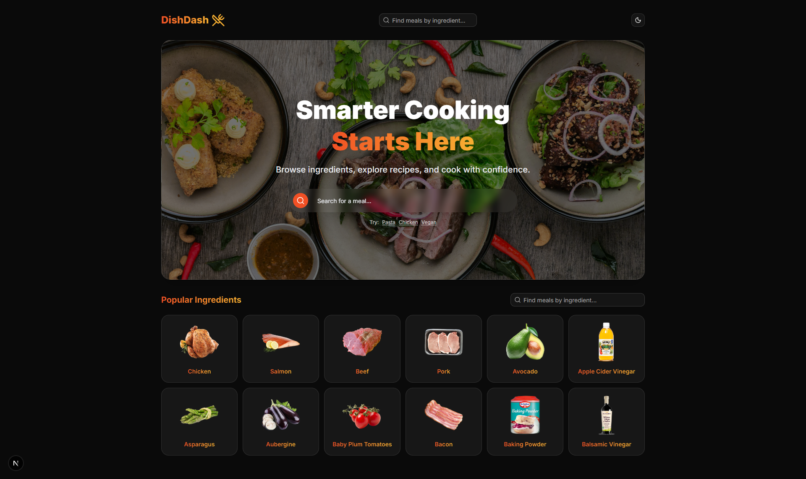
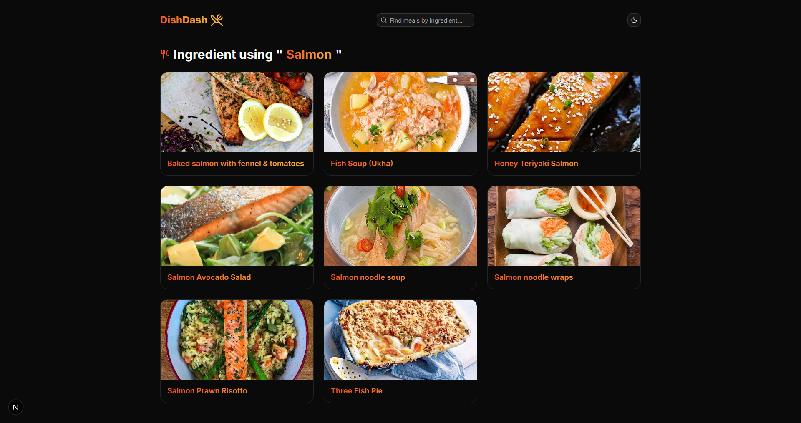
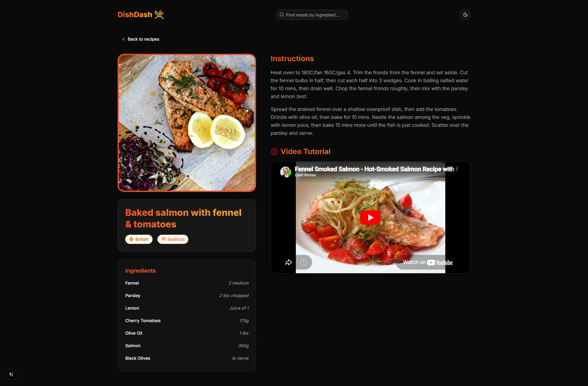
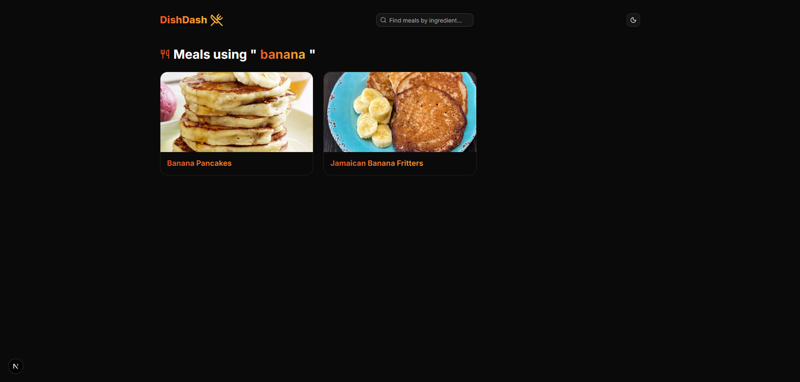

# Demo DishDash 🍲

<a href="https://cmlabs-frontend-fulltime-test-five.vercel.app/" target="_blank">
  
</a>

## 🛠️ Tech Stack

* **Framework**: [Next.js](https://nextjs.org/) (App Router)
* **Language**: [TypeScript](https://www.typescriptlang.org/)
* **Styling**: [Tailwind CSS](https://tailwindcss.com/)
* **UI Components**: [shadcn/ui](https://ui.shadcn.com/)
* **Icons**: [Lucide React](https://lucide.dev/)
* **API**: [TheMealDB](https://www.themealdb.com/api.php)
* **Package Manager**: `pnpm`

## 📦 Getting Started

### 1. Prerequisites

Ensure you have [Node.js](https://nodejs.org/) installed and the `pnpm` package manager:

```bash
npm install -g pnpm
```

### 2. Installation

Clone the repository and install dependencies:

```bash
git clone <your-repo-url>
cd dishdash
pnpm install
```

### 3. Development

Start the local development server:

```bash
pnpm dev
```

Open [http://localhost:3000](http://localhost:3000) in your browser to see the result.

## 📸 Screenshots

<p align="center">
  <b>Homepage & Search</b>
  <br>
  
</p>

<p align="center">
  <b>Filtering by Ingredient</b>
  <br>
  
</p>

<p align="center">
  <b>Meal Details & Instructions</b>
  <br>
  
</p>

<p align="center">
  <b>Search Results by Name</b>
  <br>
  
</p>

---

_Developed by Ananda Muhammad Muthaqin_
